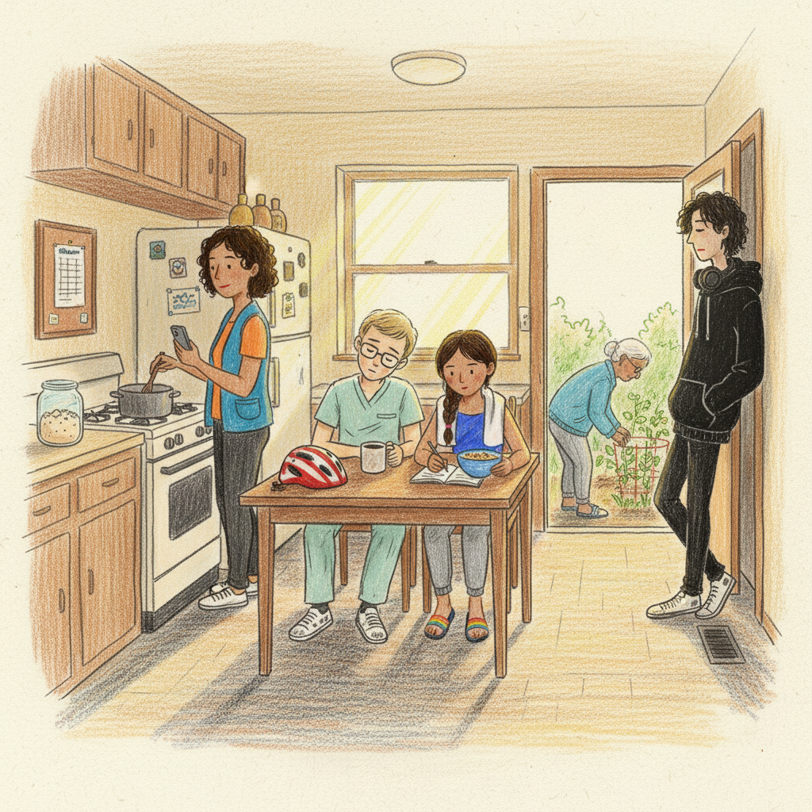
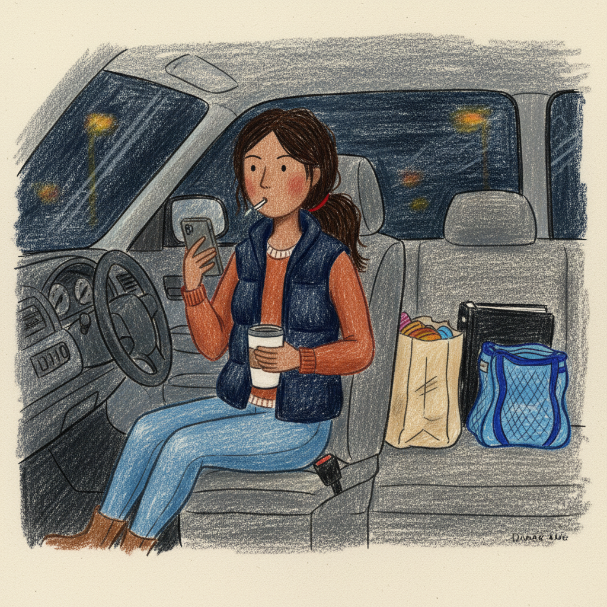
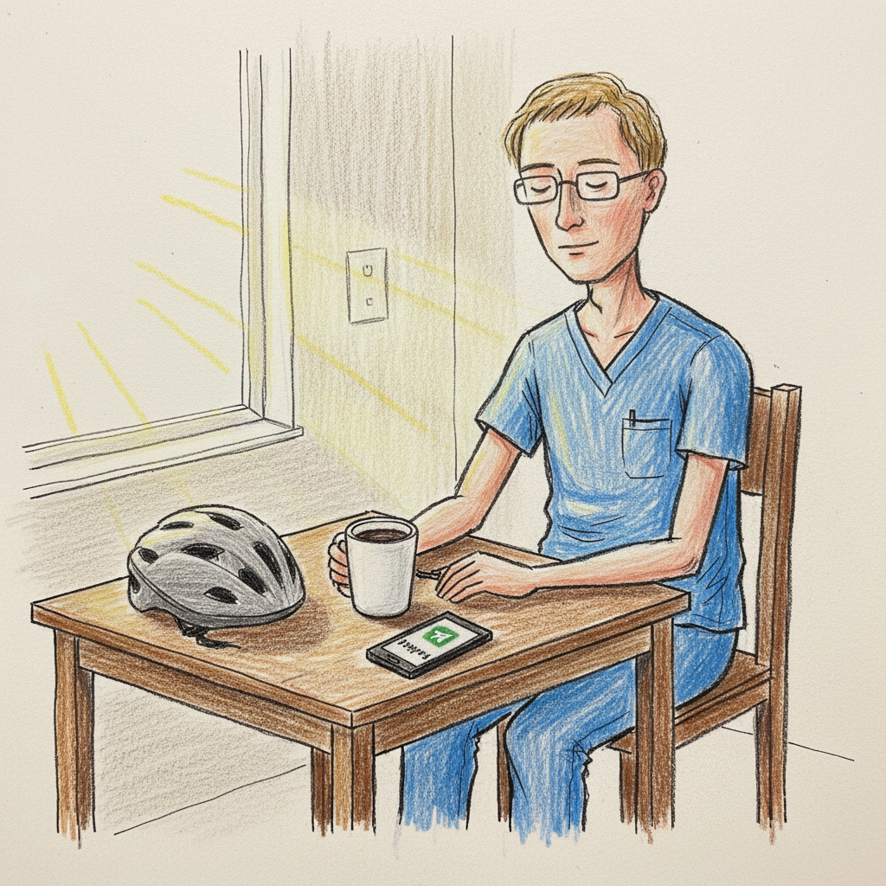
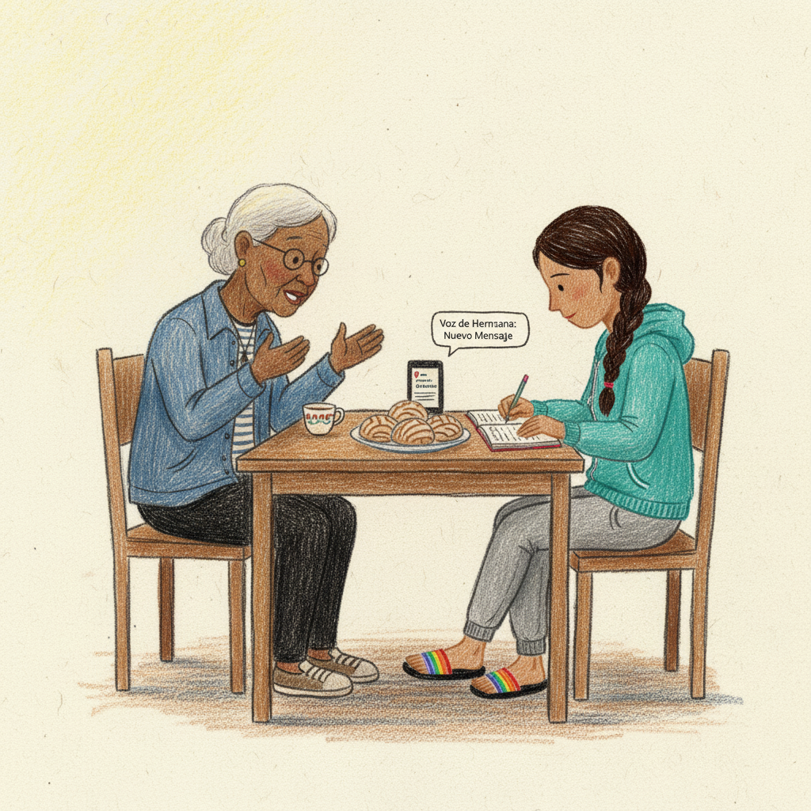
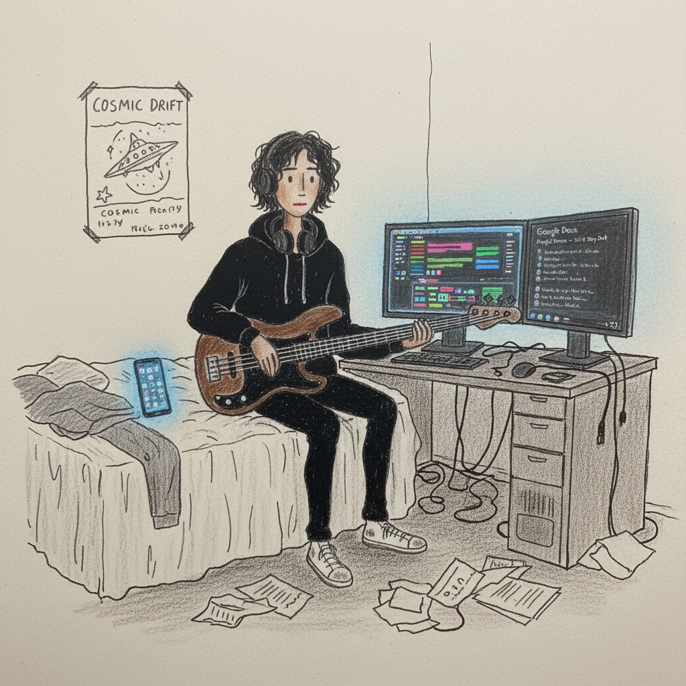
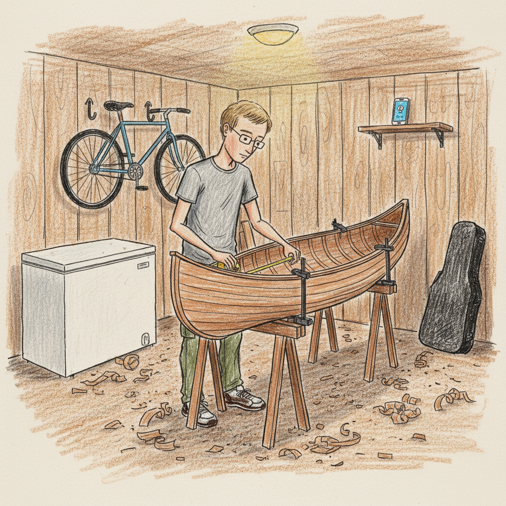

# What Is This Thing?

We're going to explain what this system is by following one family — how they use it, what it does for them, and how it works underneath. The stories come first; then we'll pull back and look at the architecture that makes them possible.

The Lund-Vegas live in South Minneapolis: Diana and James, their kids Mateo (16) and Sofia (11), and Diana's mother Rosa (74), who lives in the lower-level apartment. They have overlapping schedules, multiple languages, a shared grocery list that's always behind, and the usual chaos of five people in one house. They share a *box* — a system that holds their stuff, keeps track of things, and participates in their conversations.

It's Saturday morning. Diana is at the counter checking the family's group chat on her phone. The chat has six members: Diana, James, Rosa, Sofia, Mateo, and the box. The box posted a few things overnight. It sorted out a conflict with next week's schedule — James picked up an extra evening shift, which means he can't do Tuesday's swim drop-off, so Diana's on it. It has a question about the Costco list. Rosa replied to something in Spanish around 7am. James thumbs-up'd a message at 2am between patients.

This group chat is the primary surface: a conversation where the box is one of the participants. Not a dashboard everyone logs into separately. Not an app with a home screen. A group conversation — the box talks, everyone can see what it says and what everyone else says back. The web version is the main interface, but the same conversation is also available through Telegram, and could work through SMS or any other messaging platform. Different family members use whichever one they're already in.

## Different people, different surfaces

Not everyone interacts with the box the same way.

**Diana** is the heaviest user. She checks the group chat throughout the day. She also uses a capture page on her phone — a simple web page where she can record a voice memo, type a quick note, or snap a photo. At 5:45am in the parking lot outside the pool, waiting for Sofia to go in, she records a voice memo rattling off what needs to happen this weekend. The box will sort through it later — pull out the action items, file the reminders, ask about anything unclear. Not right now. Later.

**James** mostly interacts through the group chat. He sends a photo of his posted work schedule and the box parses it into actual dates and shifts. He thumbs-up things. Occasionally he asks the box something directly — "when's Sofia's next meet?" He's not going to seek out a separate interface. If it's in the conversation where he already is, he'll use it.

**Rosa** talks to the box in Spanish, and the box talks back in Spanish. She records voice memos — family stories, things she wants to remember, a list of things to bring up next time she calls her sister in Guadalajara. Some of these go to the group; some are private, just for the box to hold and organize for her. The cross-language thing is constant: Rosa says something in Spanish, Diana reads it in English, and the translation happens without being a separate step.

**Sofia** ends up as both a user and a data source. She asks the box things — whatever she's curious about this week, whether it's how bridges work or what happened at her last swim meet. But she's also a source without trying: her swim schedule comes in as a PDF through email, her meet results get posted, her 5:30am practices shape the whole household's week. She doesn't manage any of that. It just flows through.

**Mateo** uses the box on his own terms. He's less interested in the household coordination, but he'll ask it things — something for school, music production questions, ideas for the D&D campaign he's running. He uses it when he wants to, for his own stuff, and that's fine. The box works for him without requiring him to care about how it works for everyone else.

## Beyond the group chat

The group conversation is the center, but the box has other surfaces too.

**Capture pages** are how you get a lot of stuff in at once. Diana walks through the kitchen narrating what's in the pantry. Rosa sits in her armchair recording family stories one after another. James photographs the posted schedule at work. Each capture page is a simple web page — record, type, or photograph, and it goes into the box for processing. No forms, no categories. Just get it in; the box figures out what to do with it.

**The box reaches out on its own.** A medication reminder for Rosa. An alert that Sofia's swim schedule changed. A note that the Costco list is getting long and Diana mentioned going this weekend. These notifications come through the group chat or as direct messages — the box doesn't wait to be asked. It runs in the background, processing what came in, and surfaces what matters. What it surfaces comes from the family's own inputs — it's connecting dots between things different people said or things that arrived through email, not generating information from nothing.

**The box creates pages.** Diana's morning view isn't a designed dashboard. It's what the box put together based on what it thinks matters right now: James's schedule changed, here's the new version. Sofia has a meet this weekend. Rosa's medication refill is due. The Costco question is still open. These pages can be anything — a view of the week, a cooking page that walks you through a recipe step by step, a journal of James's canoe build assembled from photos and voice notes he's been sending. The box knows how to make web pages, and it has all the family's data, so it builds what's needed.

## What's actually going on

Here's the architecture underneath those stories. Each bolded term below corresponds to something you saw in the vignettes above.

![type:diagram | Architecture diagram of the box system. At the center is a rounded rectangle labeled "Cards (filesystem)" containing small card icons labeled "schedule", "memo", "grocery list", "story". Arrows flow in from the left from three sources: "Group Chat" (showing web and Telegram icons), "Capture Pages" (showing a microphone and camera icon), and "Connectors" (showing email and calendar icons). On the right side, arrows flow out to: "Notifications" (chat bubble icon), "Generated Pages" (web page icon), and "Group Chat" again (bidirectional). Below the center, a bar labeled "Git History" shows a chain of small commit dots. Above the center, a cloud shape labeled "Agents" has bidirectional arrows to the cards. The whole diagram sits on a cream paper background. Simple, flat, hand-drawn style — wobbly lines, colored pencil, not polished. Labels are handwritten-looking. No 3D, no gradients, no drop shadows.](images/architecture-overview.png)

**Cards and the data store.** Everything the family puts into the box — voice memos, photos, forwarded emails, chat messages, schedule PDFs — becomes structured data stored as **cards**. When Diana records a voice memo, it becomes a card. When James sends a schedule photo, the parsed shifts become cards. When Rosa tells a story in Spanish, the transcription becomes a card. Cards have schemas that define their structure, so data stays consistent even as different agents process it at different times. The filesystem is the canonical store — not a database, not a cache of some API. The files on disk are the real thing.

**The group conversation.** The group chat — whether through the web interface, Telegram, or another messaging platform — is where the box participates alongside the family. It reads what people say, responds when it has something useful, asks questions when it's uncertain. The conversation isn't a command interface; it's open-ended. People say whatever they're thinking, and the box does its best to figure out what to do with it.

**Background processing.** The box runs a cycle on its own schedule — syncing external sources (email, calendars, RSS feeds), processing new inputs, executing scheduled tasks, archiving what's done. When Diana checks the group in the morning, things have already happened. The box didn't wait for her. This is how the schedule conflict got sorted out overnight, how the swim PDF got processed, how Rosa's medication reminder went out.

**Surfaces.** The group chat, capture pages, generated pages, notifications — these are all different views into the same underlying data. A notification goes to the chat. A detailed view goes to a web page. A capture page is optimized for getting things in quickly. The surfaces are light; the substance is the cards and the processing underneath.

**Git as history.** Every change the box makes is a commit. When James's schedule gets updated, that's a commit. When Rosa's voice memo gets transcribed and filed, that's a commit. When a question gets answered, that's a commit. You can look at the history and see exactly what changed, when, and what triggered it. This isn't a feature bolted on for auditing — it's how the system works. The box's own agents read the same history to make decisions. If Diana wants to understand why the box moved Tuesday's swim ride to her, she can trace back through the commits and see the chain: James's schedule changed → evening shift on Tuesday → can't do 5:30am drop-off → Diana is the fallback.

None of this requires everyone to understand the architecture. James sends a photo of his schedule and the box handles it. Rosa records a voice memo in Spanish and it gets transcribed and filed. Sofia asks a question and gets an answer. The architecture exists so that those simple interactions work reliably, so the box can act on its own without supervision, and so that when something goes wrong — or when someone wants to understand what happened — the full chain of reasoning is there to follow.
