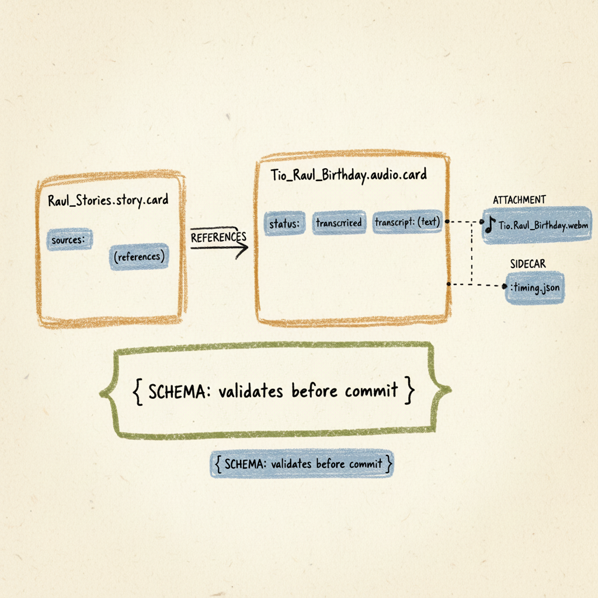
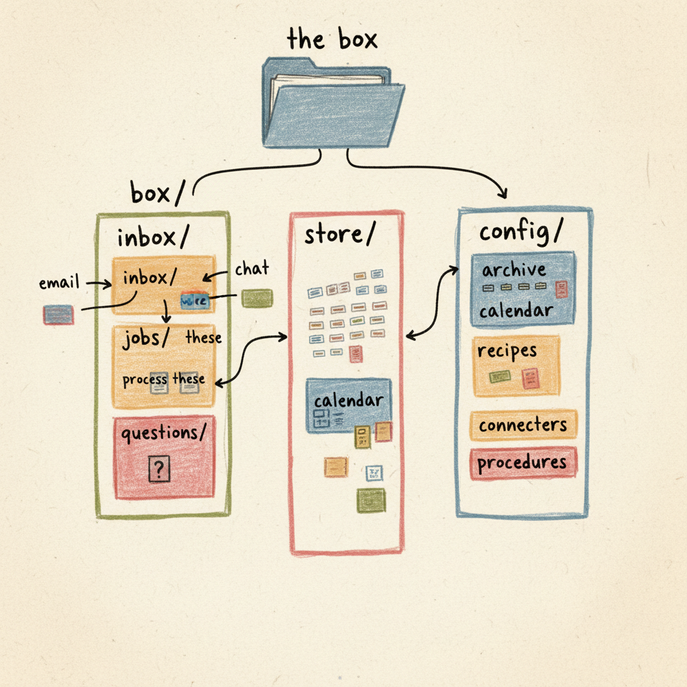
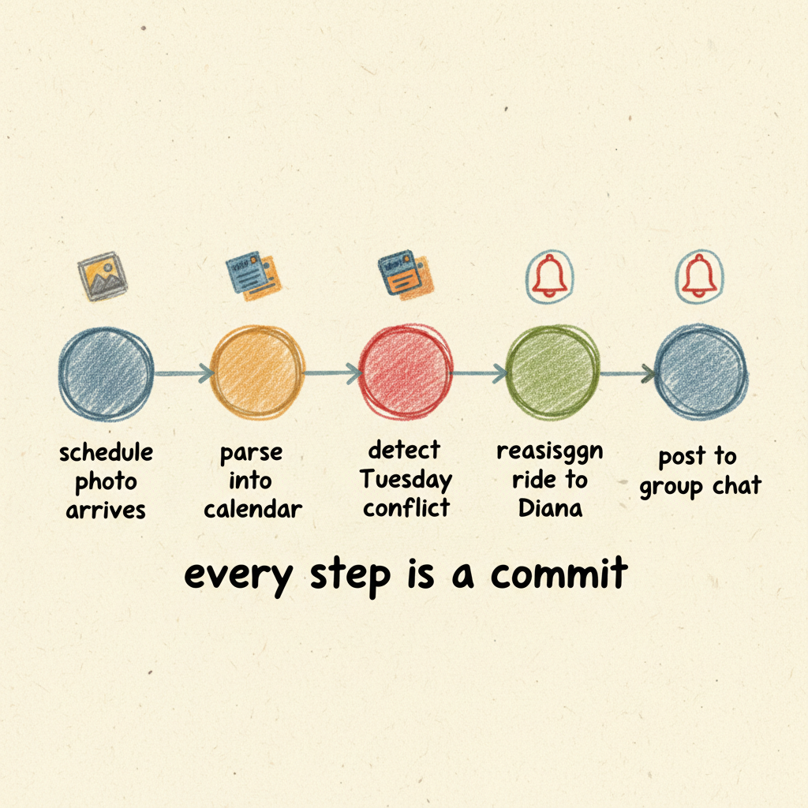

<!-- glossary: card, schema, sidecar file, procedure, commit, inbox, archive -->

# Cards and Memory

<!-- example: Rosa records family stories, box transcribes and files them
     how-to-do-it: voice memo arrives via capture page; creates audio card with .webm attachment and .timing.json sidecar; transcription is automatic; story card built from multiple audio cards requires a custom procedure (not built-in)
     prerequisites: none — this is the first introduction of cards
     spirit: best stuff comes from the people, not deficiency thinking, see the gears
     status: transcription=working, word-level sidecar=working, story pipeline=aspirational -->
Rosa has been recording family stories. Not all at once — a few minutes here and there, usually in the morning when she's sharpest. She sits in her armchair in the lower-level apartment, holds the phone close, and talks. Today she's talking about the time her uncle Raúl showed up unannounced for her mother's birthday and they had to borrow chairs from the neighbors. She records in Spanish, stops, thinks, records some more.

The box gets the audio file. It transcribes it — in Spanish, keeping her words — and creates an audio card with the transcript text and a reference to the original recording, which stays as an attachment. The transcription is fairly mechanical, so the card wraps it right away. Alongside the card and the audio, there's a timing sidecar — a JSON file that maps every phrase back to a timestamp in the recording. If you wanted to find the moment Rosa said a particular phrase, you could search the text, match it to the word-level timestamps, and jump to that point in the audio. Not a simple "click to go back" — it takes some work to line things up — but the data is there.

Over time, Rosa has dozens of these audio cards. She wants them organized — not just transcribed, but turned into something she could share with family back home. Short written stories, cleaned up but still in her voice. This is a separate thing from transcription: a story card that pulls from one or more audio cards, combining and editing the material. The transcription is mechanical. The story is creative work — and it's something she'd set up herself, a procedure with specific instructions for how to handle the text. Take a transcript, preserve the original language, clean up the false starts and repetitions, produce a formatted version. The procedure shows its work — here's the original line, here's what changed, here's why. So four layers end up existing: the original audio, the raw transcript, a cleaned-up text, and a finished story. Each one is its own card or file, each one is kept, and each one points back to where it came from.

<!-- example: Diana's Monday morning weekly view
     how-to-do-it: schedule photo → calendar entries (working); swim meet from email PDF → calendar (working); doctor appointment from email → calendar (working); grocery list card (working); assembled view is a generated page (working but layout is basic)
     prerequisites: cards (introduced above), calendar integration
     spirit: it should feel like a place
     status: working -->
## What Diana sees on Monday morning

Diana checks the week ahead on her phone. The box shows her: James is on evening shifts Tuesday through Thursday. Sofia has a swim meet Saturday morning. Rosa has a doctor's appointment Wednesday at 10. The Costco list has 14 items and someone added laundry detergent overnight.

Some of those things are cards. The Costco list is a card — a list card with items and who added them. Rosa's doctor's appointment came in through email and became a calendar event. James's schedule came from a photo he sent of the posted schedule, and the box parsed it into calendar entries. Sofia's swim meet arrived as a PDF. They were all created at different times, from different sources, by different parts of the system. The commit history shows the trail: an email arrived (commit), an event was created from it (commit), a photo was parsed (commit).

The view Diana sees isn't stored anywhere as a view. The box assembled it from the structured data that seemed relevant to her week. If she asked why Rosa's appointment is on the calendar, she could trace it back through the commits to the email that triggered it.

<!-- prerequisites: the vignettes above introduced cards informally; this section defines them
     spirit: see the gears, messy is expected (schemas have escape valves)
     status: working -->
## What a card actually is

A card is a file. Specifically, a file on disk — YAML frontmatter plus a markdown body — with a name like `Tio_Raul_Birthday.audio.card` or `Costco_List.list.card`. The name has two parts that matter: a human-readable label and a type. The type — `audio`, `memo`, `list`, `question` — determines what the card can contain. Everything is in the filename: you know what a card is and roughly what it's about without opening it. This matters because the filename is human-readable and LLM-readable at the same time — an agent listing a directory already knows what it's looking at.

Each card type has a schema. The schema says what fields exist, what values are valid, what's required and what's optional. An audio card has a filename reference, a transcript, and a status. A memo card has content and a source — did this come from a voice recording, a text message, an email? An event card has a date, a time, a location.

Schemas prevent drift. When you have a lot of different material coming in from a lot of different sources, processed by agents that learn partly from examples, things can get inconsistent. An agent might start leaving out fields it thinks are unimportant, or inventing fields that don't exist. The schema catches that — the card has to validate before it's committed. This is especially useful for provenance fields. We can require that every card records where its data came from, and because the field is required, the agent is compelled to fill it in rather than skipping it.

Rosa's audio card is a good example. The recording comes in, the box transcribes it automatically, and the card wraps the result with the metadata the schema requires — the filename, the transcript text, the status. A story card, on the other hand, would be more inclusive — Rosa's words reorganized and combined from several recordings. Not every card type needs tight enforcement. Some schemas are strict about structure; others are mostly containers with a few required fields for provenance.

<!-- prerequisites: cards, sidecar files, procedures
     spirit: best stuff comes from the people, see the gears
     status: sidecar audio=working, word-level transcription=working, layered story pipeline=aspirational -->
## Keeping the originals

When the box processes Rosa's voice memo, it creates an audio card. The recording stays as an attachment in a sibling `.attach/` directory: `Tio_Raul_Birthday.audio.card` and `Tio_Raul_Birthday.attach/Tio_Raul_Birthday.webm`. The transcribed text goes inside the card. The word-level timing data sits alongside in the same attach scope, mapping timestamps to phrases.

Later, when Rosa's procedure builds a story from several recordings, the story card is a new thing — `Raul_Stories.story.card` — that references the audio cards it drew from. The story has Rosa's words cleaned up and reorganized, but each audio card still has the raw transcript, and each raw transcript still has the recording behind it. Four layers: audio, raw transcript, cleaned-up text, finished story. Each one points back to where it came from. If something looks off at any layer, you can check the layer below.

The same principle applies to James's schedule photo. The box parsed it into calendar entries with specific dates and times. But the photo is the source of truth — the posted schedule on the wall at Hennepin Healthcare. If the box misread "Thursday evening" as "Thursday morning," the photo is what you'd check.

Not every card has an original behind it. When Diana types a note into the group chat, the text *is* the original. When Sofia's swim schedule arrives as a structured PDF, the extraction is straightforward enough that keeping the PDF around is less important. But whenever the box is interpreting messy input — transcribing audio, reading a photo, parsing a forwarded email — the original should stay.

<!-- prerequisites: cards
     spirit: see the gears, it should feel like a place
     status: working -->
## The filesystem is the truth

Cards aren't stored in a database. They're files in directories on disk. You could open a terminal, navigate to the box, and see them: `box/inbox/` for things that just arrived, `store/` for things that have been processed and filed, `config/` for settings and procedures. The directory structure is the organization. Moving a card from inbox to archive is literally moving a file.

This means the box's state is always inspectable with ordinary tools. You can `ls` a directory and see what's there. You can open a card in a text editor and read it. You don't need special software to understand what the box is holding — the files are the thing, not a projection of some hidden state.

<!-- prerequisites: cards, filesystem layout, commits
     spirit: see the gears — every action has a source, every decision has a reason
     status: working -->
## Git is the history

Every change the box makes is a git commit. When Rosa's voice memo gets transcribed and filed, that's a commit. When James's schedule photo gets parsed into calendar entries, that's a commit. When Diana answers a question, that's a commit. When the box moves a card from inbox to archive, that's a commit.

Each commit records what changed, when, and what triggered it. "Pull 1 Gmail thread" — that's the swim schedule PDF arriving. "Process inbox: transcribe 2 voice memos" — that's Rosa's stories being turned into cards. The commit history is a real, browsable log of everything the box has done.

This isn't just for auditing. The box's own agents read the same history when making decisions. If an agent needs to know when James's schedule last changed, it looks at the commit log. If Diana wants to understand why Tuesday's ride arrangement changed, she can trace the commits: James's new schedule arrived (here's the commit), the calendar was updated (here's the commit), the conflict was detected and the ride was reassigned (here's the commit). The reasoning isn't hidden — it's the same history anyone can look at.

<!-- prerequisites: all concepts from this section (cards, schemas, originals, filesystem, git) -->
## What this adds up to

**Cards** are typed, structured data — the box's organized understanding of what it's been given. **Schemas** keep that understanding consistent and machine-readable without being rigid. **Originals** are preserved alongside the box's interpretation, so the source material is always available. The **filesystem** is the canonical store — files on disk, navigable with ordinary tools. **Git** is the canonical history — every change traceable, every action attributable, readable by both people and agents.

When Rosa records a story, it goes from audio to audio card to story card — and every layer is kept, traceable back to the moment she said it. When she sets up a procedure to turn those recordings into polished stories, each edit is visible and grounded in her original words. When James sends a schedule photo, it goes from image to calendar entries, and the photo is still there if anything looks wrong. The architecture isn't separate from those stories. It's what makes them work.
