# Composer states

A map of the chat composer's UI across its state combinations — what each
button shows, how you reach the state, and where you can go from it. Audience:
us, doing UI polish. Companion to `docs/composer-input-machine.md`, which
describes the `composerMachine` that now backs this surface.

The composer is the bottom button bar (+ inline textarea on desktop, + a
drop-up textarea row on mobile) plus two header chips (the narration badge and
the mute button) that change with the same state. Screenshots are tight
viewport crops: desktop at 1100×380 (header + bar), mobile at 390-wide (bar /
typing row).

## State dimensions

The composer's appearance is a function of these, most read straight off the
machines that own them:

| Dimension | Values | Owner |
|---|---|---|
| voice coordination | `idle` / `speaking` / `pausedForSpeech` | `composerMachine` |
| transcription | `idle` / `connecting` / `recording` / `reconnecting` / `finalizing` | `realtimeTranscriptionMachine` (→ `isTranscribing`) |
| TTS playback | playing / not | `speechPlaybackMachine` (→ `speechPlaying`) |
| agent turn | streaming / not | `chatMachine` (→ `isStreaming`) |
| narration | on / off | model hook (→ header badge, mic icon) |
| narration HQ | in flight / not | `composerMachine.hq` (→ badge sub-label) |
| muted | on / off | mute hook (→ header mute icon) |
| typed input | empty / non-empty | component state (→ Send enabled) |
| mobile keyboard | closed / open.unlocked / open.locked | `typingMode` / `typingLocked` |
| device | desktop (≥`sm`) / mobile (<`sm`) | viewport |

## The two state-dependent controls

**Mic / voice toggle** — a strict priority cascade:

| Condition | Icon | Title |
|---|---|---|
| `voicePaused` (`voice === pausedForSpeech`) | pulsing mic + pause badge | "Resume recording (stops speech)" |
| `isTranscribing` | red stop square | "Stop recording" |
| `narrationEnabled` | mic-with-bubble | "Voice input (narration mode)" |
| else | plain mic | "Voice input" |

**Stop buttons** (can show together, left of the mic): `speechPlaying` → "Stop
speaking" (**speaker-x** — audio semantics, rhymes with the header mute icon);
`isStreaming` → "Stop agent" (**stop-in-circle**). Deliberately different
glyphs: they used to be identical, so when one showed alone you couldn't tell
which action you were about to take.

---

# Named states — desktop

## Idle, empty

The resting state. `+` (Add menu), the textarea placeholder "Type or paste an
image…", a **disabled** Send (faint up-arrow), and the plain **mic** ("Voice
input"). Header: speaker (unmuted), no narration badge.

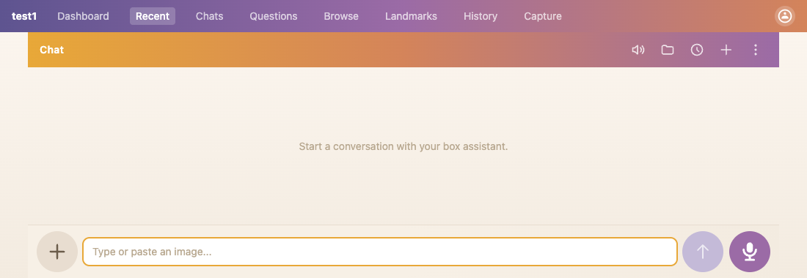

→ **Typing** (type text) · **Recording** (tap mic) · toggle **narration** /
**muted** from the header/debug menu.

## Typing (Send enabled)

Any non-empty input flips Send to the solid accent up-arrow; the mic is
unchanged (you can still dictate instead). Enter sends; Shift+Enter / Ctrl+J
newline.

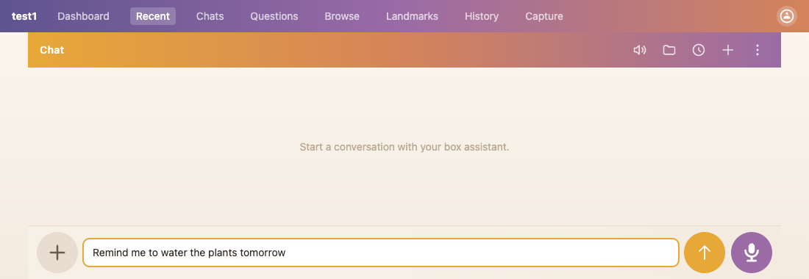

→ **Idle** (clear / send) · send fires `MESSAGE_SENT` (ends any voice turn).

## Narration mode

Header gains the `🎙️ narration ×` badge; the mic swaps to the
**mic-with-speech-bubble** icon ("Voice input (narration mode)"). Narration
means silent/structured replies and an HQ transcription pass on send.

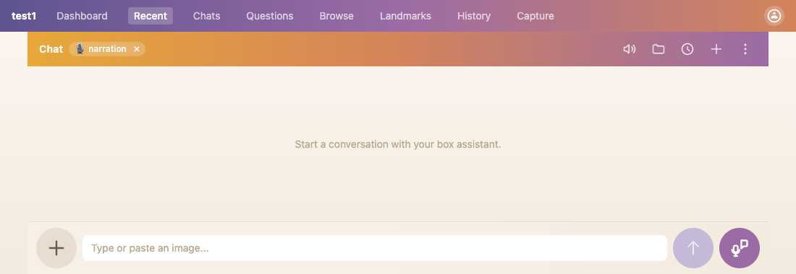

→ while an HQ pass is in flight after a voice send, the badge gains a
`· transcribing…` sub-label (`composerMachine.hq === inFlight`) — *capture
pending, see below*.

## Muted

The header speaker becomes the muted icon (speaker-×, pressed). Queued TTS is
never played (`markPlayed`), so the "Stop speaking" button and the
speaking/paused states can't occur while muted.

---

# Named states — mobile

## Idle, empty

Below `sm`, the textarea is hidden; the bar is icon-only: `+`, a spacer, the
**keyboard** button, and the **mic**. (Stop-speaking / Stop-agent appear
between the spacer and keyboard when active.)

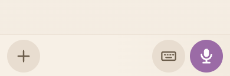

→ **Keyboard** (tap ⌨ → typing row) · **Recording** (tap mic).

## Keyboard open (typing)

The keyboard button opens a drop-up textarea row with its own Send, plus a
**lock** and **close** affordance above it (the button bar is hidden). Unlocked,
the row closes after send; locked (`typingLocked`), it stays open.

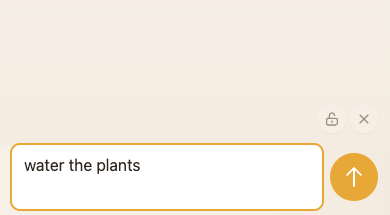

Locked, the lock button fills in (primary background) so the state reads at a
glance — the open-vs-closed padlock outline alone was illegible at that size:

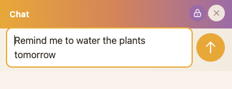

→ **lock** keeps it open across sends · **close** returns to the icon bar.

---

# Voice states — desktop

These are the states the machine work was really about. They normally need a
live mic / TTS, so the shots below are from the dev gallery
(`/dev/composer-states`, dev-only) which renders the real presentational
composer with fabricated props. Behaviour is documented from the code.

## Recording (`isTranscribing`)

Mic button becomes a **red stop square** ("Stop recording"). The textarea goes
read-only showing the live transcript, with Cancel (✕) / Edit (✎) / Send
controls. All mic status lives in the `MicOverlay` floating above the voice
button: live volume bars (flat = no audio reaching the recorder, e.g. wrong
mic selected) over a rotating voice-keyword hint, filtered to actions valid
for the current text — only `"mic off"` until words arrive. In `reconnecting`
(network or mic recovery in flight) the bars turn amber and a "recovering…"
chip replaces the hint: moving amber bars = network blip (mic still hears
you), flat amber bars = the mic itself is gone.

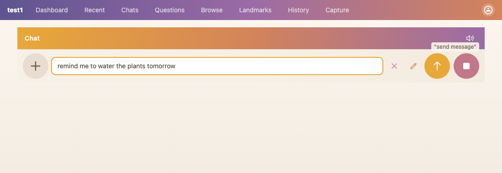

Before any words arrive the placeholder reads "Listening…" and Send is
disabled — there's nothing to commit yet (pressing it used to silently cancel
the dictation):

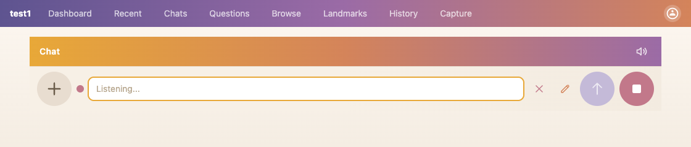

→ **Cancel/Esc** (`STOP_DICTATION`) · **keyword send** (`KEYWORD_SEND` → commit
→ keep recording) · speech queued while recording → **pausedForSpeech**.

## Paused for speech (`voicePaused`)

Mic button is a **pulsing mic with a pause badge** ("Resume recording (stops
speech)") — the mic is the action (tap to get it back), the badge is the state —
and the **Stop speaking** speaker-x shows. Reached when the agent speaks while
you were recording — the mic is cancelled and TTS plays.

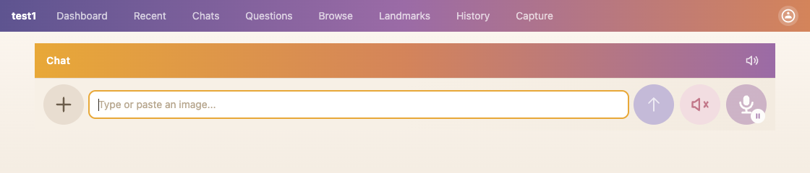

→ **playback ends** → auto-resume mic (`resumeMic`) · **Resume** tap / **Stop
speaking** → resume mic. This state replaced the old `voicePaused` boolean; it
should *not* flicker between the agent's sentences.

## Speaking, not paused (`speaking`)

**Stop speaking** shows; the mic stays the plain/narration mic (it wasn't
recording). Reached when the agent speaks and you weren't mid-utterance (a
replay-while-idle, or a spoken reply to a typed message).

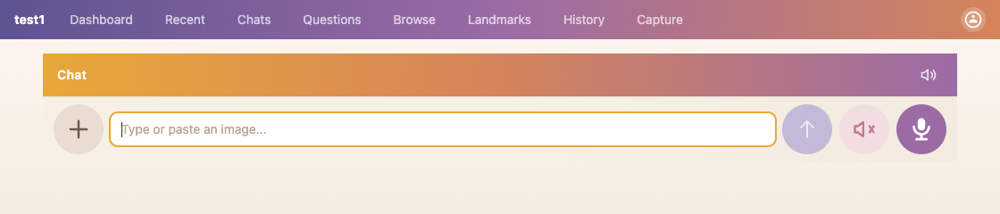

→ **playback ends** → idle (or reopen mic if a voice turn is active) · **Stop
speaking** → idle.

## Agent streaming (`isStreaming`)

A **Stop agent** danger-circle (independent of the mic), shown while the agent
replies:

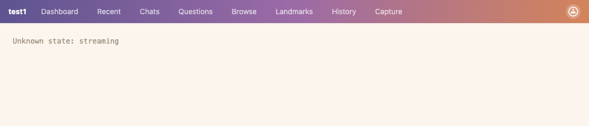

It overlays the voice states too — here alongside Stop-speaking during
mid-stream speech (speaker-x + stop circle, one per concern):

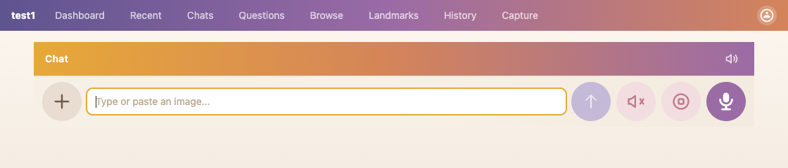

## Narration HQ in flight (`hq === inFlight`)

The narration badge gains a `· transcribing…` sub-label while the HQ round-trip
runs after a voice send; the mic has usually already reopened.

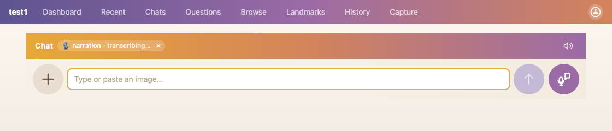

---

# Voice states — mobile

The mobile bar is icon-only; transcription shows the drop-up row beneath it, and
the Stop-speaking / Stop-agent circles slot in between the spacer and the
keyboard button.

Recording — red stop-square mic + the drop-up transcript row:

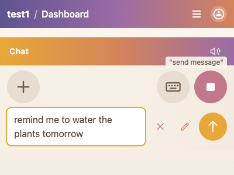

Paused for speech — Stop-speaking speaker-x + pulsing mic with pause badge:

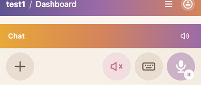

Speaking — Stop-speaking speaker-x + plain mic:

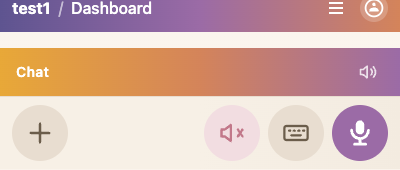

---

# Realizable combinations (raw)

`R` = recording, `Sp` = speaking, `Pa` = pausedForSpeech, `St` = streaming,
`N` = narration, `M` = muted, `T` = typed text present.

| voice | mic+transcription | TTS | stream | shows |
|---|---|---|---|---|
| idle | idle | — | — | mic; Send (T→enabled) |
| idle | idle | — | St | mic; **Stop agent** |
| idle | recording | — | — | **stop-square**; Cancel/Edit/Send |
| idle | recording | — | St | stop-square + **Stop agent** (post-voice-send, agent replying) |
| speaking | idle | playing | — | mic; **Stop speaking** |
| speaking | idle | playing | St | mic; **Stop speaking** + **Stop agent** (mid-stream speech) |
| pausedForSpeech | idle (cancelled) | playing | — | **mic + pause badge**; **Stop speaking** |
| pausedForSpeech | idle (cancelled) | playing | St | mic + pause badge; Stop speaking + Stop agent |

× narration (badge + mic-bubble icon) and × muted (mute icon; forces TTS off)
overlay the rows above, except where excluded below.

# Impossible combinations (and why)

- **recording + (speaking | pausedForSpeech)** — speech queued *while recording*
  cancels the mic and enters `pausedForSpeech`; you can't be capturing and have
  the machine in a TTS state at once. (`isTranscribing && speechPlaying` was a
  latent edge in the old code; the overlay machine makes it unreachable — entering
  recording from `speaking` stops playback first.)
- **muted + (speaking | pausedForSpeech)** — muted makes every queued segment
  `markPlayed` (never played), so no TTS state is entered, and muting in-flight
  speech sends `STOP_SPEECH`.
- **pausedForSpeech + not playing** — `pausedForSpeech` is only held while
  playback runs; it resumes the mic the instant playback ends. (The old
  `voicePaused && speechPlaying` AND existed to paper over a brief window where
  this *could* desync — gone now.)
- **voice `speaking`/`pausedForSpeech` without `speechPlaying`** — same: those
  states exist only to coordinate active playback.
- **typed-input-enabled Send while recording** — during transcription the
  textarea is read-only and shows the transcript, not editable input; Send for
  typed text is replaced by the Cancel/Edit/Send transcription controls.
- **mobile inline textarea while idle** — below `sm` the textarea only mounts in
  `typingMode` or while transcribing; otherwise the bar is icon-only.

---

## Regenerating these shots

The idle / typing / narration / muted shots come from a live chat session; the
voice states come from the dev gallery at **`/dev/composer-states`** (dev-only,
omitted from production builds — see `router.tsx` and
`pages/dev/components/ComposerStatesHarness.tsx`). The gallery renders the real
presentational composer with fabricated props, so it stays prop-typed against
the components and breaks the typecheck if their contracts drift.

The gallery doesn't hand-pick states — it declares the axes (button bar:
primary mode × narration × muted × streaming; mobile keyboard: lock × input;
plus the recording-before-words card), takes the cross-product, filters the
impossible combos (listing them with reasons), and renders all **37**
realizable ones. Each card is keyed by its active axes
(`idle`, `idle-streaming`, `recording-narration-muted`, `recording-empty`,
`typing-keyboard-locked`, …); isolate one with `?state=<key>` for a clean
capture. To re-shoot, point `bin/browse` at
`/dev/composer-states?state=<key>` and `screenshot`. The named-state shots above
are the readable subset; the gallery is the exhaustive grid.
