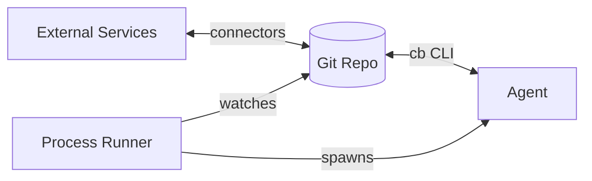
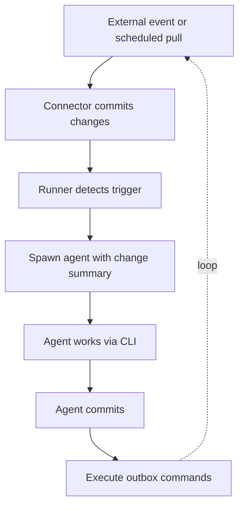
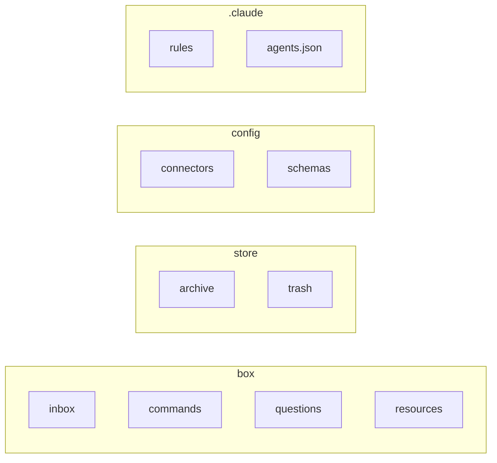

> **Note:** References to "command cards", `box/commands/`, `cb do`, and `cb execute-commands` in this document are outdated. The command card system has been removed. External actions are now handled through the reactor/jobs model.

# Callback Box: Implementation Guide

This document describes how to build Callback Box, complementing DESIGN.md with concrete implementation details.

## Core Principle: Git as the State Engine

The filesystem is the interface, but **Git is the state engine**. This means:

- Persistent state changes are commits
- The CLI is the primary interface (not raw Git) - it wraps Git and handles operations that don't map cleanly to commits (like dry runs)
- External sync happens between agent turns - connectors pull, commit changes, then agents see the new state
- Agents get a "what changed since last run" summary when spawned
- Conflicts are explicit and resolvable

### Provenance is explicit, not free

Git history tracks *when* things changed, but **provenance** - where data came from and how it flowed - must be explicitly maintained:

- Incoming items get a `<source>` element or attribute recording origin (email message-id, calendar event id, etc.)
- When items are processed or transformed, they link back to their sources (exact mechanism TBD - could be refs, paths, or source attributes)
- Internal paths serve as stable identifiers that survive moves and renames (via cardworks reference updating)

---

## System Architecture

### High-level view



### The turn cycle



---

## 1. Filesystem Layout



The working state lives in `/box/` - this is where agents do their work. Historical data goes in `/store/`. Configuration lives in `/config/`. Agent behavior is defined in `/.claude/`.

### Primary directories

| Directory | Purpose |
|-----------|---------|
| `/box/inbox/` | Incoming items awaiting processing |
| `/box/commands/` | Commands ready to execute |
| `/box/questions/` | Pending questions awaiting user answers |
| `/box/resources/` | Synced external state (calendar, contacts/) |
| `/store/archive/done/` | Successfully executed commands |
| `/store/archive/failed/` | Failed command executions |
| `/store/archive/processed/` | Processed inbox items |
| `/store/trash/` | Soft-deleted items |
| `/config/connectors/` | Connector configuration (credentials, settings) |
| `/config/schemas/` | Card type definitions |
| `/.claude/` | Agent definitions, rules, Claude Code settings |

### File naming conventions

Following cardworks conventions:
- `Name.type.card` for cards (e.g., `Meeting_Tomorrow.event.card`)
- Title_Case for specific/proper names
- kebab-case for generic names
- Version attribute is optional (useful for schema evolution, but not required)

### Attachments

Binary files (audio, images, PDFs) accompany cards using the same basename:

```
/box/inbox/Voice_Memo_2024-01-15.memo.card
/box/inbox/Voice_Memo_2024-01-15.m4a
```

For cards with multiple attachments, use a subdirectory:

```
/box/inbox/Email_With_Attachments.email.card
/box/inbox/Email_With_Attachments/
  attachment1.pdf
  attachment2.png
```

The card references attachments by filename; the convention keeps them co-located.

---

## 2. Process Runner

The system is idle until a trigger fires. No continuous polling or watching - everything waits for a wakeup.

### The wakeup model

```
idle ──trigger──▶ wakeup ──▶ gather context ──▶ spawn agent ──▶ agent works ──▶ idle
```

Nothing runs in the background. Triggers come from outside:

- **Connector poll completes**: Connector fetches data, commits, calls `cb wakeup`
- **Scheduled job**: Cron or timer fires, calls `cb wakeup`
- **Manual**: User runs `cb wakeup` from CLI or web frontend
- **Post-commit hook**: After certain commits, automatically wakes up

### What `cb wakeup` does

Wakeup is idempotent - you can call it anytime and it figures out what needs doing by inspecting the filesystem:

```
1. Acquire lock (single-threaded - only one wakeup runs at a time)
2. Detect what needs attention:
   - New/unprocessed items in /box/inbox/ (status="new")
   - Ready commands in /box/commands/ (status="ready")
   - Answered questions in /box/questions/ (status="answered")
   - Resource changes (diff /box/resources/ against last known state)
3. If nothing to do, release lock and return
4. Spawn appropriate agent based on what's pending:
   - Inbox items → triage agent
   - Ready commands → execute agent
   - Answered questions → resume previous session
   - Resource changes → react agent
5. Agent works, commits changes
6. Run tailing phase (cb tail)
7. Release lock, return to idle
```

The filesystem IS the index - directory locations and status attributes determine what's been processed and what hasn't.

### Triggers in practice

- **Manual**: User or web frontend calls `cb wakeup`
- **Connector**: After pulling/committing, connector calls `cb wakeup`
- **Scheduled**: System timer fires based on scheduled task cards
- **Any time**: Safe to call repeatedly - it just checks and exits if nothing to do

### Tailing phase

After each agent run completes, a "tailing" phase runs:

```
Agent run completes
    ↓
cb tail
    ↓
1. Index cards (update sidecars, search indexes)
2. Find all scheduled task cards anywhere in repo
3. Calculate next scheduled wakeup time
4. Schedule that trigger (system timer, launchd, etc.)
    ↓
Return to idle
```

This keeps schedules as data in the repo rather than external configuration.

### Scheduled task cards

Schedules use [iCalendar RRULE](https://icalendar.org/iCalendar-RFC-5545/3-3-10-recurrence-rule.html) format for recurrence—the same standard used by Google Calendar, Apple Calendar, etc.

```xml
<scheduled status="active">
  <rrule>FREQ=WEEKLY;BYDAY=MO,TU,WE,TH,FR</rrule>
  <time>09:00</time>
  <agent>daily-triage</agent>
  <prompt>Review the inbox and prepare a daily digest.</prompt>
</scheduled>
```

One-time future tasks use `<at>` with ISO datetime:

```xml
<scheduled status="pending">
  <at>2024-01-20T14:00:00</at>
  <agent>meeting-prep</agent>
  <prompt>Prepare materials for Q1 planning meeting.</prompt>
</scheduled>
```

Simple sync actions (for connectors without push support):

```xml
<scheduled status="active">
  <rrule>FREQ=MINUTELY;INTERVAL=15</rrule>
  <action>cb pull email</action>
</scheduled>
```

See EXAMPLE_FILES.md for full RRULE format reference.

Schedules can also be embedded in other cards. The tailing phase finds all schedule entries, calculates the next wakeup time, and archives one-time tasks that have no remaining future occurrences.

Note: Some connectors (like calendar) may support push/webhook triggers rather than polling, which is preferred when available.

### Run modes

- **Triage**: Process new items in `/box/inbox/`, sort/preprocess
- **Process**: Handle specific items, create commands
- **Execute**: Run pending commands in `/box/commands/`
- **React**: Respond to external changes (e.g., calendar updated)

---

## 3. Connectors

Connectors bridge external services to the filesystem. Each connector:

1. **Pulls** external state into the repo and commits it
2. **Executes** commands by pushing changes back out
3. **Transforms** between external format and cards

### Connector-command mapping

Each connector knows which card types it handles. This is code-based—the connector implementation declares its card types in a registry:

```typescript
// In email-connector.ts
export const emailConnector: Connector = {
  name: "email",
  handles: ["email-reply", "email-forward"],  // command types this connector executes
  produces: ["email-thread"],                  // card types this connector creates on pull
  // ...
};
```

When `cb do` runs a command, it looks up the connector from this registry based on the card type.

### Connector configuration

Each connector has a config card in `/config/connectors/`:

```
/config/connectors/email.connector.card
/config/connectors/calendar.connector.card
/config/connectors/voice.connector.card
```

Config includes credential references, polling intervals, filters, etc. Agents can read these to understand what's available but typically don't modify them. See [EXAMPLE_FILES.md](./EXAMPLE_FILES.md) for connector card examples.

### How connectors work

**On pull:**
1. Connector fetches external state (IMAP, Google Calendar API, etc.)
2. Transforms to card format
3. Writes to `/box/inbox/` or `/box/resources/`
4. Commits with descriptive message
5. Triggers the process runner

**On execute:**
1. Runner finds a command card the connector handles
2. Connector reads the command, performs the action
3. Commits result (success/failure) to `/store/archive/`

### Initial connectors

#### Email Connector
- **Pull**: Fetch from IMAP, create email thread cards in `/box/inbox/`
- **Execute**: Send email-reply commands via SMTP
- **Threading**: Emails are grouped into threads. New messages append to existing thread cards if the thread is still in inbox. If the thread was already processed, the new message references it via `<continues ref="..."/>`

#### Calendar Connector
- **Pull**: Fetch from Google Calendar API, write `/box/resources/calendar.card`
- **Execute**: Create/update/delete events from calendar-command cards
- **React**: On pull, describe changes so agents can respond

#### Voice Memo Connector
- **Input**: Audio files added to a staging location, then `cb wakeup` called
- **Process**: Transcribe audio, create memo card in `/box/inbox/`
- **Attachments**: Original audio kept alongside transcript card

### Connector errors

Connectors can fail during pull or execution. Error handling:

- **Pull failures**: Logged to `/config/connectors/<name>.logs/` with timestamp. The connector config card can track last successful sync.
- **Execution failures**: The command card gets `status="failed"` with a `<result>` element describing the failure, then moves to archive.

---

## 4. The Git Workflow

### Commit as action

The fundamental pattern: **to do something, commit it**.

```
Agent wants to send an email:
1. Creates /box/commands/Reply_To_Bob.email-reply.card with status="draft"
2. Commits
3. Validation runs (schema check, connector-specific validation)
4. If valid, status changes to "ready" (or "hold" if needs review)
5. Execution run picks up ready commands
6. Connector executes (or does dry-run first)
7. Connector commits result to /store/archive/
```

### Branches and sync

```
main           - the canonical state
connector/*    - connectors work here, merge to main
agent/*        - agent runs work here, merge to main
```

Or simpler: everything on main with careful commit ordering.

### Pull semantics

When a connector pulls:
1. Fetch external state
2. Diff against current `/resources/` state
3. Commit changes with descriptive message
4. Runner can trigger reaction runs based on what changed

### Push semantics

When executing outbound commands:
1. Find pending commands in `/box/commands/`
2. Execute via appropriate connector
3. Commit result (move to archive, add execution record)

---

## 5. Command Lifecycle

Commands are cards in `/box/commands/` that represent actions to take.

### Command states

Commands use a `status` attribute:

| Status | Meaning |
|--------|---------|
| `draft` | Just created, needs validation |
| `invalid` | Failed validation, needs fixing |
| `ready` | Validated, ready to execute |
| `hold` | Valid but paused for review |
| `running` | Currently executing |
| `done` | Executed successfully (in `/store/archive/`) |
| `failed` | Execution failed (in `/store/archive/`) |

Commands stay in `/box/commands/` until executed, then move to `/store/archive/`.

### Command card structure

Each command type has its own schema with two kinds of fields:

- **Payload fields**: The action itself (recipients, content, times, etc.)
- **Authorization fields**: Why the action is justified (source, user intent, risk assessment)

Different command types require different authorization. For example:

| Command Type | Authorization Fields |
|--------------|---------------------|
| `email-reply` | source, recipient-relationship, user-intent |
| `calendar-event` | source, conflicts-checked, user-intent |
| `notification` | source, urgency, reason |
| `http-request` | source, endpoint-trust, data-sensitivity, user-intent |

This structure lets agents document their reasoning, and lets humans (or validation rules) verify that commands are properly justified before execution.

See [EXAMPLE_FILES.md](./EXAMPLE_FILES.md) for concrete card examples.

### Dry run

Each connector implements its own dry-run logic to describe what would happen:

- Email: Shows rendered message, recipients, attachments
- Calendar: Shows event diff (what would be created/modified/deleted)
- etc.

The dry-run result is connector-specific and aims to give the best possible preview of the action's effects. Results can be stored as a preview card for review before execution.

---

## 6. CLI for Agents

Agents interact with the system through a CLI that wraps git and adds callback-box semantics.

### Core commands

```bash
# Initialize a new callback box
cb init

# Wake up and process pending items
cb wakeup

# Check current context (what agent would see)
cb context

# Pull external state
cb pull email
cb pull calendar
cb pull --all

# Committing (wraps git commit with validation)
cb commit -m "Process inbox item"

# Execute a specific command
cb do /box/commands/Reply_To_Alice.email-reply.card
cb do Reply_To_Alice       # shorthand if unambiguous
cb do --dry-run Reply_To_Alice  # preview without executing

# Execute all ready commands
cb exec                    # all ready commands
cb exec --dry-run          # preview all

# Validate cards against schemas
cb validate /box/inbox/
cb validate --all

# Create a new card from a template
cb create /box/commands/Reply.email-reply.card reply-to=/box/inbox/Thread.email-thread.card
cb create /box/inbox/Question.question.card context=/box/inbox/Item.card

# Move with reference updates (wraps cardworks)
cb move /box/inbox/Item.card /store/archive/processed/Item.card

# Run tailing phase manually
cb tail

# Show scheduled tasks
cb scheduled
```

### Hooks

Git hooks enforce invariants:
- **pre-commit**: Validate all changed cards against schemas
- **post-commit**: Trigger reaction runs if needed

---

## 7. Sidecars

**Deferred** - Derived data (search indexes, embeddings, cached calculations) will need a home eventually. Location and implementation TBD.

---

## 8. Schemas

Schemas define valid card structures using Zod (via cardworks).

### Schema location

```
/config/schemas/email-thread.schema.ts
/config/schemas/email-reply.schema.ts
/config/schemas/calendar-event.schema.ts
/config/schemas/question.schema.ts
/config/schemas/registry.ts          # explicit list of all schemas
```

### Schema registration

Schemas must be explicitly registered in `registry.ts`. A linter checks that all schemas are registered and that all card types have corresponding schemas.

See [EXAMPLE_FILES.md](./EXAMPLE_FILES.md) for schema examples.

### Validation and the agent loop

All cards must validate against their schema. Validation happens primarily in the agent loop:

- If an agent creates an invalid card, the validation error is surfaced immediately
- The agent is expected to fix the card before continuing—it can't exit with invalid cards
- Pre-commit hooks provide a backstop, rejecting commits with invalid cards
- This keeps the repo always in a valid state

When schemas change, agents handle migration - either manually editing cards or with help from migration prompts. Migration is not fully automated; the agent decides how to update existing cards to match new schemas.

---

## 9. Question Loop

When an agent can't proceed, it creates a question card.

### Question card structure

See [EXAMPLE_FILES.md](./EXAMPLE_FILES.md) for question card examples.

### Input types

- `type="select"` - pick one option
- `type="multiselect"` - pick multiple (checkboxes)
- `type="text"` - free text response
- `type="select-or-text"` - options with a free text fallback

### Question flow

1. Agent creates question in `/box/questions/` with `status="pending"`
2. Question surfaces to user via dashboard, voice prompt, etc.
3. User answers (voice, typing, UI)
4. Answer is added to the card, status changes to `"answered"`
5. Next `cb wakeup` detects answered questions and resumes the session

Questions live in `/box/questions/` while pending. The wakeup process naturally detects answered questions by checking for `status="answered"` cards—no special notification needed. The session reference in the question card tells wakeup which agent session to resume.

---

## 10. Web Frontend

A web UI provides visibility into everything happening in the system. Initially this is a debugging/viewer interface - full transparency into the system state. Later it may split into a cleaner user-facing view and a debug backend.

### What it shows

- **Inbox**: All items in `/box/inbox/`, with card contents
- **Commands**: Pending commands in `/box/commands/`, their status, dry-run previews
- **Resources**: Current state of synced resources (calendar, etc.)
- **Archive**: Recent processed items and execution results
- **Git log**: Recent commits with diffs
- **Agent runs**: Current/recent agent sessions, what they're doing, their output
- **Questions**: Pending questions waiting for answers (with UI to answer them)

### Implementation approach

The frontend reads directly from the git repo:
- Card contents via cardworks
- Git history via git commands
- Agent run logs from `.claude/` session files

### Input capabilities

The web UI is also an input surface:
- **Answer questions**: First/simplest question-answering provider
- **Create test inputs**: Inject artificial items into inbox for testing
- **Manually create cards**: Commands, inbox items, etc.
- **Trigger runs**: Manually invoke `cb run` with specific modes
- **Approve/reject commands**: Change status on held commands

Other question-answering providers (voice, notifications, etc.) can be added later, but the web UI is the easiest starting point.

### Debugging vs user-facing

Initially everything is debug-oriented - full visibility into all state and operations. Later this may split:
- **Debug view**: Full access, all internals visible, for development
- **User view**: Cleaner interface focused on questions, pending actions, activity feed

---

## 11. Agent Execution

The agent runs via the Claude Code CLI (`claude`). The process runner invokes it with appropriate options.

### Basic invocation

```bash
claude --print \
  --append-system-prompt "$(cb context)" \
  --allowed-tools "Bash(cb:*) Read Edit Write Glob Grep" \
  --permission-mode delegate \
  --agent triage \
  "Process new items in /box/inbox/"
```

### Key CLI options used

| Option | Purpose |
|--------|---------|
| `--print` | Non-interactive mode, output and exit |
| `--agent` | Use a defined subagent (triage, process, execute, etc.) |
| `--append-system-prompt` | Dynamic context (change summary, pending items) |
| `--allowed-tools` | Restrict to safe operations (cb CLI, file ops) |
| `--permission-mode delegate` | Let the runner handle permissions |
| `--max-budget-usd` | Cost guardrails |
| `--resume` | Continue a previous session (for question answers) |

### Subagents

Different run modes use different subagents, defined in `/.claude/agents.json`:

```json
{
  "triage": {
    "description": "Process inbox items, sort and preprocess",
    "prompt": "You are triaging incoming items...",
    "allowedTools": ["Bash(cb:*)", "Read", "Edit", "Write", "Glob", "Grep"]
  },
  "process": {
    "description": "Handle specific items, create commands",
    "prompt": "You are processing items and creating commands...",
    "allowedTools": ["Bash(cb:*)", "Read", "Edit", "Write", "Glob", "Grep"]
  },
  "execute": {
    "description": "Review and execute pending commands",
    "prompt": "You are reviewing commands for execution...",
    "allowedTools": ["Bash(cb:*)", "Read"]
  }
}
```

Each subagent has appropriate tool restrictions - e.g., the execute agent is more limited since it's approving actions.

### Agent session logs

Agent sessions are Claude Code sessions, and their logs live in the normal `.claude/` directory alongside the project. This means:

- Full conversation history is preserved
- Sessions can be resumed (for question answers)
- The web frontend can read these for debugging/visibility
- No separate log infrastructure needed

### Dynamic context injection

The `cb context` command generates current state for the agent:

```
## Recent changes (since last run)
- Added: /box/inbox/Meeting_Tomorrow.email-thread.card
- Modified: /box/resources/calendar.card

## Pending items
- 3 items in /box/inbox/
- 1 command in /box/commands/ (status: ready)

## Active question
- /box/inbox/Question_About_Project.question.card (waiting for answer)
```

---

## 12. Rules and Context Loading

Rules provide dynamic context based on what files the agent is working with. We use Claude Code's native `.claude/` directory for this.

### Using .claude/ directory

The `.claude/` directory is managed by Callback Box:

```
/.claude/
  CLAUDE.md              # Base instructions for all agents
  agents.json            # Subagent definitions
  rules/
    email.md             # Rules for email cards
    calendar.md          # Rules for calendar operations
    commands.md          # Rules for creating/validating commands
  settings.json          # Claude Code settings
```

### Rule format

Rules use Claude Code's native format with glob patterns:

```markdown
---
globs:
  - "/box/inbox/*.email-thread.card"
  - "/box/commands/*.email-reply.card"
  - "/store/archive/**/*.email-thread.card"
---

# Email Processing Rules

When handling email cards:
- Always check the sender against known contacts
- Preserve threading information in replies
- Flag potential spam for review rather than auto-processing
```

When the agent reads or edits a file matching the pattern, the rule is automatically loaded into context.

### CLAUDE.md

The root `CLAUDE.md` (or `/.claude/CLAUDE.md`) contains base instructions:

```markdown
# Callback Box Agent

You are operating within a Callback Box environment. All work happens through cards (XML files) and the `cb` CLI.

## Key commands
- `cb commit` - commit changes
- `cb validate` - check cards against schemas
- `cb move` - move cards with reference updates
- `cb context` - see current state

## Important
- Always commit after making changes
- Create commands in /box/commands/ for external actions
- Ask questions via question cards when uncertain
```

### Generated vs static rules

Some rules are static (checked into the repo), others are generated:
- Static: General processing guidelines, schema documentation
- Generated: Current connector configs, active user preferences

---

## MVP: Minimal Viable System

The MVP goal: a system you can actually use day-to-day, with enough connectors to handle real input and output.

### MVP Connectors

#### Signal Connector (Bidirectional)

Signal serves as the primary DM and notification channel. It handles both incoming messages and outgoing notifications/questions.

**Incoming:**
- Receive text messages as inbox items
- Receive images/voice notes as attachments
- **Question/answer resolution**: The incoming stream isn't formally structured—the connector must match incoming messages to pending questions. This is a good test case for connector intelligence: "This message looks like an answer to the question I asked 10 minutes ago."

**Outgoing:**
- Send notifications (reminders, alerts, status updates)
- Send questions to the user and receive answers
- Confirmations for pending actions

**Implementation notes:**
- Use [signal-cli](https://github.com/AsamK/signal-cli) or similar library
- Messages are a stream; connector adds context about timing and conversation flow
- Question matching heuristics: timing, reply patterns, content similarity to pending questions

#### Email Connector (Read-only initially)

**Pull:**
- IMAP connection to fetch new emails
- Create email-thread cards in `/box/inbox/`
- Thread grouping (new messages append to existing thread cards if unprocessed)

**Execute (deferred):**
- SMTP sending for email-reply commands
- Draft creation for review

**Implementation notes:**
- Standard IMAP library
- Focus on inbox reading first; sending can come later
- Consider Gmail API as alternative (better for Google accounts)

#### Calendar Connector (Read-only initially)

**Pull:**
- Google Calendar API integration
- Write current state to `/box/resources/calendar.card`
- Generate change descriptions for agent reactions

**Execute (deferred):**
- Create/update/delete events from calendar-event command cards

**Implementation notes:**
- Google Calendar API with OAuth
- Focus on read + change detection first
- Event creation can come later

#### Voice Connector

**Input:**
- Audio files from staging directory
- Whisper transcription to text
- Create memo cards with transcript and audio attachment
- Time markers in transcript for reference back to audio

**Implementation notes:**
- Local Whisper or API-based transcription
- Audio staging via file drop or dedicated capture app
- Transcript quality varies; keep original audio for clarification

#### RSS Connector

**Pull:**
- Scheduled feed fetching (configured feeds)
- Create news/article cards in `/box/inbox/`
- Deduplication based on article IDs

**Implementation notes:**
- Standard RSS/Atom parsing
- Scheduled pulls (e.g., every few hours)
- Feed list in connector config

### MVP Infrastructure

#### Web App (Frontend + Runner)

The web app is the central piece—it's the frontend for visibility AND the process runner. For MVP, this is a single long-running app you keep open to monitor the system.

**Why combined:**
- The runner needs to listen for events (connector webhooks, timers, file changes)
- A webapp is already a long-running process with an event loop
- Combining them means one thing to run, one thing to monitor
- You see what's happening as it happens

**Frontend features:**
- View all cards (inbox, commands, questions, resources)
- Answer pending questions
- View agent run logs and output (live)
- Manual triggers (`cb wakeup`, `cb pull`)
- Create test inputs for development

**Runner features:**
- Listen for connector events (webhooks, polling results)
- Handle scheduled triggers (internal timers)
- Spawn agents via `cb wakeup`
- Single-threaded execution (one wakeup at a time)
- Tailing phase for scheduling next wakeup

**Implementation notes:**
- Node.js server (Express/Fastify)
- Read from git repo via cardworks (from `~/src/cardworks`)
- WebSocket for live updates to browser
- Internal timer for scheduled wakeups
- Start with full debug visibility; polish later

#### Scheduling System

**Core features:**
- Parse RRULE schedules from schedule cards
- Calculate next wakeup time after each run
- Set internal timer in the webapp process
- Archive completed one-time tasks

**Initial schedules:**
- RSS feed polling (every few hours)
- Email polling (every 15 minutes or so)
- Daily inbox review (if desired)

**Note:** For MVP, scheduling is in-process timers in the webapp. Later could integrate with launchd/systemd for wakeups when the app isn't running.

### MVP Scope Boundaries

**In scope:**
- All five connectors (Signal, email, calendar, voice, RSS)
- Web frontend with full visibility
- Question/answer flow including Signal-based Q&A
- Basic scheduling
- Core command lifecycle (create, validate, execute)

**Deferred:**
- Email sending (read-only first)
- Calendar event creation (read-only first)
- Untrusted content tokenization
- Sidecars and derived data indexes
- Multiple users
- Cloud deployment

### Concrete Pieces

What actually gets built:

```
callback-box/
├── src/
│   ├── cli/                    # cb command
│   │   ├── index.ts            # CLI entry point
│   │   ├── commands/
│   │   │   ├── init.ts
│   │   │   ├── wakeup.ts
│   │   │   ├── commit.ts
│   │   │   ├── validate.ts
│   │   │   ├── pull.ts
│   │   │   ├── do.ts
│   │   │   ├── exec.ts
│   │   │   ├── move.ts
│   │   │   ├── create.ts
│   │   │   ├── context.ts
│   │   │   ├── tail.ts
│   │   │   └── scheduled.ts
│   │   └── lib/
│   │       ├── git.ts          # git operations
│   │       ├── lock.ts         # wakeup lock
│   │       └── agent.ts        # spawn claude
│   │
│   ├── connectors/
│   │   ├── index.ts            # connector registry
│   │   ├── signal.ts
│   │   ├── email.ts
│   │   ├── calendar.ts
│   │   ├── voice.ts
│   │   └── rss.ts
│   │
│   ├── webapp/                 # combined frontend + runner
│   │   ├── server.ts           # express/fastify server
│   │   ├── runner.ts           # event handling, agent spawning
│   │   ├── scheduler.ts        # timer management
│   │   ├── routes/
│   │   │   ├── api.ts          # REST endpoints
│   │   │   └── webhooks.ts     # connector webhooks
│   │   └── frontend/
│   │       ├── index.html
│   │       ├── app.ts          # client-side JS
│   │       └── styles.css
│   │
│   └── schemas/                # Zod schemas for card types
│       ├── index.ts
│       ├── email-thread.ts
│       ├── email-reply.ts
│       ├── memo.ts
│       ├── question.ts
│       ├── calendar.ts
│       ├── scheduled.ts
│       └── ...
│
├── package.json
├── tsconfig.json
└── bin/
    └── cb                      # CLI binary
```

**External dependency:** cardworks library at `~/src/cardworks` for XML parsing/validation.

### MVP Success Criteria

The MVP is "working" when you can:
1. Record a voice memo → it appears in inbox → agent processes it
2. Receive an email → agent creates a response (held for review)
3. See your calendar → agent notices conflicts or prep needs
4. Get a Signal message with a question → answer via Signal → agent resumes
5. Read RSS → agent surfaces interesting items
6. Ask the agent to do something → it asks clarifying questions → you answer → it proceeds

---

## Testing and Debugging

The system should be inspectable and manipulable for interactive debugging, not just automated tests.

### Git as replay mechanism

Git gives us time travel:
- Every state change is a commit
- To replay: checkout any commit, run again from that state
- To compare: run from same starting point, diff results
- Commits are the unit of "what happened"

### Test mode

Environment variable (`CB_TEST=1` or similar) puts the system in simulation mode:
- Connectors log what they *would* do but don't execute
- External calls recorded as dry-run results
- Agent still runs, still creates commands, but execution is faked
- Everything else is real—files, git commits, state changes

This allows full end-to-end testing without touching real services.

### Commit metadata

Commits should carry structured metadata for debugging (exact format TBD):
- What triggered this run (schedule, webhook, manual, answered-question)
- Which agent ran
- What items were processed
- Session ID for resumption

Possibly via git trailers, commit message format, or separate mechanism.

### Logs and timeline confusion

**Open question:** Where do verbose logs live?

Problem: If you checkout an old commit to replay, you don't want logs from a different timeline confusing things.

Options being considered:
- Logs outside the repo (won't time-travel with checkouts, but won't confuse)
- Logs in repo but in `.gitignore`'d directory
- Minimal structured info in commits, verbose logs elsewhere
- Clear log files on checkout/replay

### Inspection CLI commands

Commands for seeing what's there:
- `cb status` — what's pending, current state summary
- `cb show <card>` — dump card contents, pretty-printed
- `cb log` — recent activity and runs
- `cb diff` — changes since last commit/run

### Simulation CLI commands

Commands for creating test scenarios:
- `cb inject <type>` — create fake inbox items
- `cb fake-answer <question>` — answer a question from CLI
- `cb step` — run one processing cycle, stop
- `cb dry-run` — show what would happen

### Open questions for testing

- When does `cb` commit vs when does the agent commit?
- What are the natural commit points in a run?
- How to handle connector mocks elegantly?

---

## Open Questions

1. **Branch strategy**: Work on main, or use feature branches for agent runs?
2. **Conflict resolution**: What happens if two agents edit the same card?
3. **Authentication**: How do connectors store credentials securely?
4. **Multi-user**: Is this single-user only, or could multiple people share a box?
5. **Commit boundaries**: When does cb commit vs when does the agent commit?
6. **Log storage**: Where do verbose logs go without causing timeline confusion?
