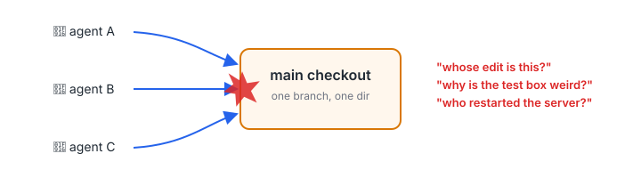
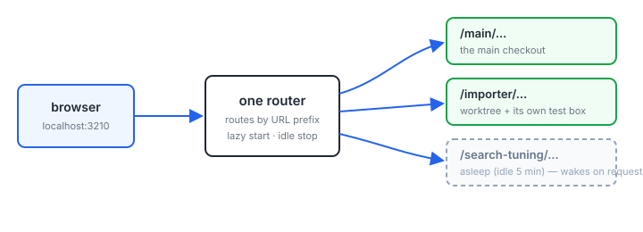
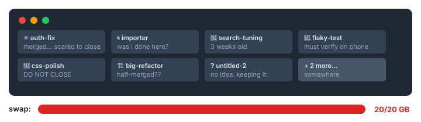
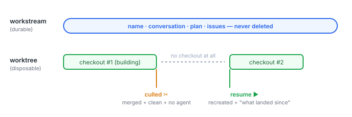
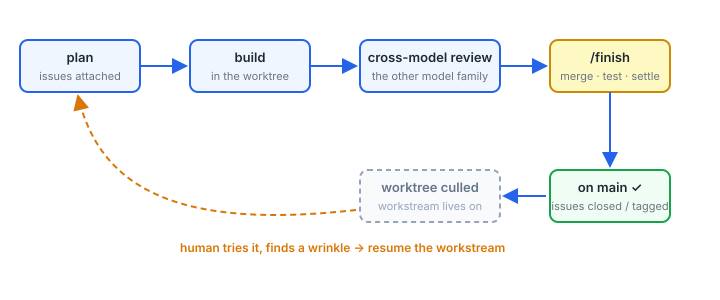
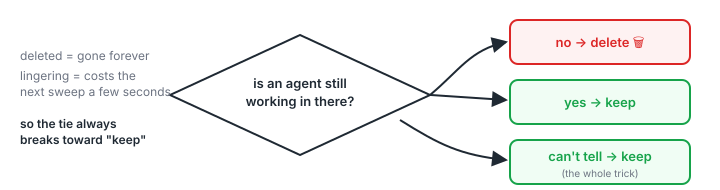
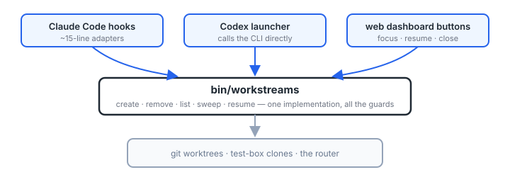

# Sessions Are Not a To-Do Database

*How one repo grew a process for running many coding agents in parallel — and why each piece exists.*

---

## Act I: everybody on main

One checkout. Several agent sessions at once, each told to "stay in your area."

They did not stay in their area.



Meanwhile the to-do list was: the developer's head, plus one giant TODO file where some items were lovingly detailed and others were a single cryptic word.

## Worktrees, and one router to serve them all

Every session gets its own checkout (`git worktree`) and its own clone of the test data. One dev router serves all of them by URL prefix — a worktree cold-starts on the first request and stops after 5 idle minutes.



Spinning up a parallel session became cheap. Which caused the *real* problem.

## The tab bar becomes a database

An open session was the only record of "this still needs checking." So closing a tab felt lossy — and tabs accumulated. At peak: ~9 live sessions, 20 GB of swap, gone.



The sentence that reorganized everything:

> **"Sessions are currently doing double duty as a to-do database."**

Close a tab and you lose the record. Keep the record in the tab and you can never close it. The fix isn't tab management — it's separating the durable thing from the disposable thing.

## The split: workstream ≠ worktree

- A **workstream** is the durable unit: a named line of work, its conversation, its plan, its issues.
- A **worktree** is just the checkout currently attached to it. A cache.

Merged and clean? The worktree gets *culled* — that detaches storage, it doesn't end the workstream. Resume later and the checkout is recreated, with a note about what landed on main in the meantime.



Now closing a tab costs nothing. The tab bar goes back to being a tab bar.

## Issues had to grow up at the same time

None of the above works if findings still live in sessions. So the to-do database became an actual database: one small markdown file per issue, category directories, machine-readable frontmatter.

```yaml
---
title: "Sweep's live-agent guard fails open"
workstream: unattached        # who OWNS resolving it
discovered-in: worktree-importer — while testing sync
needs: [manual-testing]
---
```

Two separate fields, on purpose: **ownership** (`workstream:`) and **provenance** (`discovered-in:`). A session can notice something outside its own job, file it, and move on — the finding outlives the worktree that found it. Filing is not a mandate: most items are *tensions, not resolutions*, waiting for the developer to pick them.

Worktrees, workstreams, and the issue queue co-evolved. None of the three stands alone.

## The loop

What one workstream actually does:



Two beats worth naming:

- **Cross-model review**: anything bigger than a small fix gets reviewed by the *other* model family. Claude's work is reviewed by Codex; Codex's by Claude. A model can't catch the blind spots it shares with itself.
- **`/finish` is how work comes back**: merge main in, run everything, reconcile the plan document, close the issues this work resolved (or tag them "landed, needs a human to try it"), then land on main. The workstream's records get settled *before* the worktree becomes disposable.

## Cleanup: one rule, applied everywhere

Automated deletion is the scariest part of all this — a culled worktree with unsaved work is just gone. Every guard reduces to one asymmetry:



A lingering worktree costs the next sweep a few seconds. A wrongly deleted one is unrecoverable. So liveness is *tri-state* — `none` / `live` / `unknown` — and **unknown counts as live**. Even `--force` won't override a liveness check. Most of the scarred-looking paragraphs in the internal docs are this one rule meeting some new way for "can't tell" to happen.

## The seam test: two different agent CLIs

All the worktree lifecycle logic originally lived inside Claude Code's hook system. That worked — until a second agent CLI (OpenAI's Codex) needed the same lifecycle and had to *impersonate Claude Code's hook JSON* to reach it.

So the logic moved into a plain CLI, and every frontend became a thin client:



The payoff: adding Codex sessions turned out to be *surprisingly easy* — a good sign the seam was in the right place. It's also why off-the-shelf agent orchestrators didn't fit: they own this exact layer, and you can't wire your own issue queue and finish flow into a monolith.

## Coda

Most multi-agent setups are **role-based**: a planner, a coder, a reviewer, all on one task.

This is **domain-based**: each workstream owns one line of work end-to-end, and the process — durable workstreams, disposable sessions, an issue queue that outlives both, a finish ritual that settles the records — is what makes a dozen parallel lines survivable for one human.
